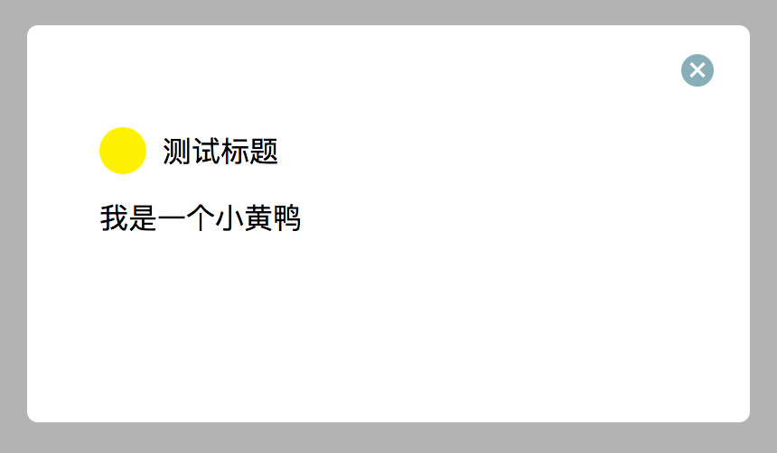
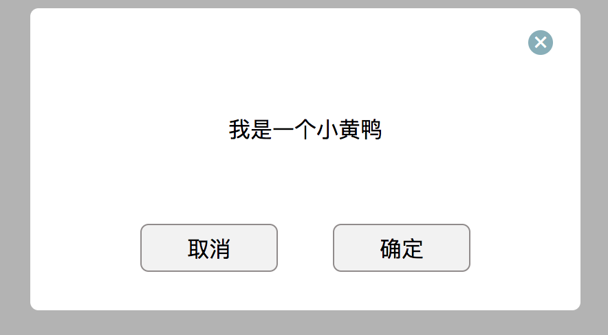

## 介绍
一个弹窗提示组件
使用：
```js
var tips = Modal({
    tipsTitle:'dfsfsfsf', // 可选 默认
    tips:'sdfsfsfsff', // 必填
    timeout:1500, // 可选
    btnFn:function(){ // 回调函数
        console.log(1111)
    }
})
// 调用方式
tips.$tips()
//
tips.$part()
//
tips.$all()
```
## screenShot
$tips

$part

$all

## start

```js

npm install

gulp

```
